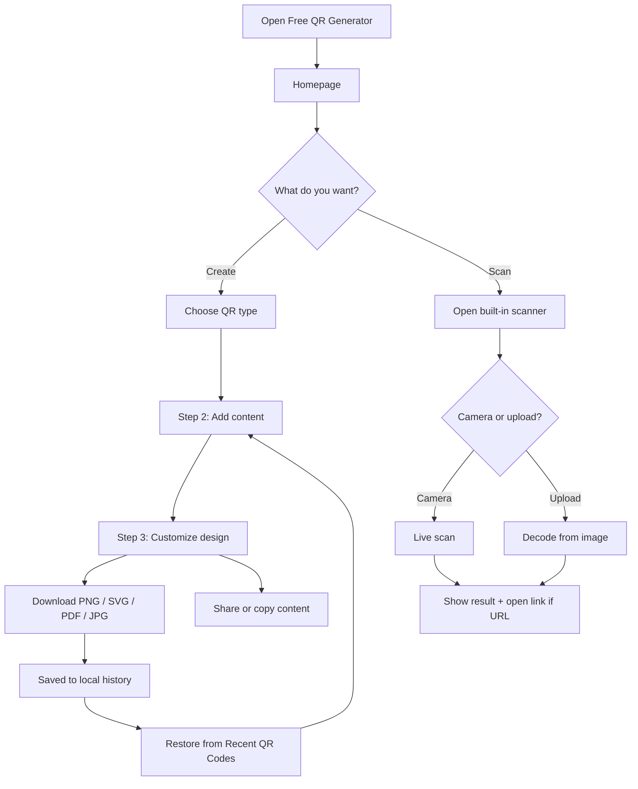
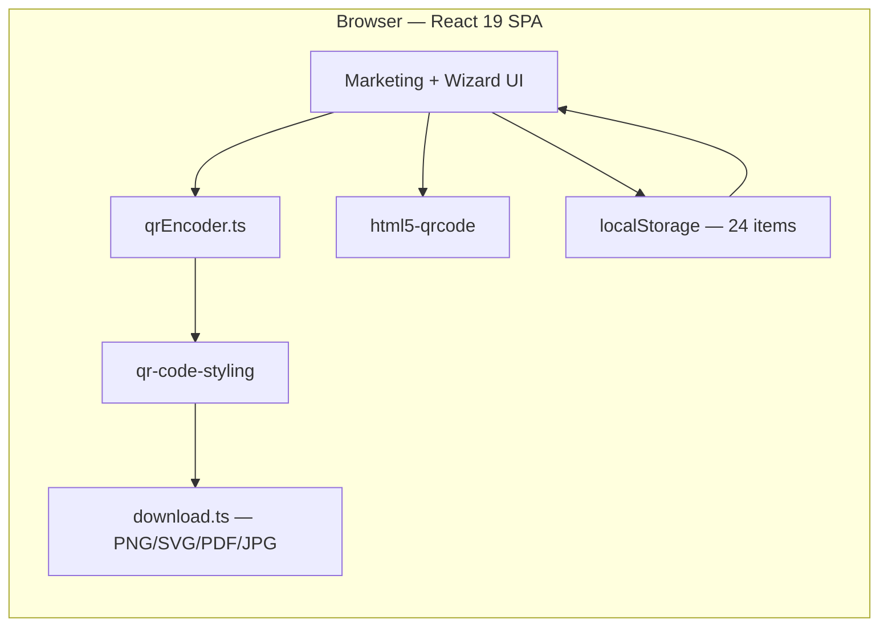

<div align="center">

# Free QR Code Generator

### Create Static QR Codes In Seconds.


**Generate, Customize, Download and Scan QR codes — Entirely in your browser. No account. No expiry. No server.**

[](https://freeqrcodegen.vercel.app/)
[](https://react.dev/)
[](https://vite.dev/)
[](https://www.typescriptlang.org/)
[](https://tailwindcss.com/)

**[Try it live](https://freeqrcodegen.vercel.app/)**

</div>

---

## Table of Contents

- [Overview](#overview)
- [Key Features](#key-features)
- [User Flow](#user-flow)
- [Architecture](#architecture)
- [Tech Stack](#tech-stack)
- [Quick Start](#quick-start)
- [QR Content Types](#qr-content-types)
- [Project Structure](#project-structure)
- [Available Scripts](#available-scripts)
- [Deployment](#deployment)
- [How Static QR Codes Work](#how-static-qr-codes-work)
- [Privacy](#privacy)
- [License](#license)

---

## Overview

**Free QR Code Generator** is a production-ready, client-side web app for creating **static QR codes** — the kind that encode your data directly and never depend on a redirect service or subscription.

Pick from **12+ content types** (URL, vCard, Wi-Fi, phone, email, PDF, menu, app links, and more), walk through a simple **3-step wizard**, customize colors, frames, and logos, then download as **PNG, SVG, PDF, or JPG**. A built-in **camera scanner** reads any QR code in the browser, and your recent designs are saved locally so you can restore them anytime.

Everything runs in the browser. Nothing is uploaded to a backend.

---

## Key Features

- **100% static QR codes** — content is encoded directly; codes never expire and work offline after download
- **12+ content types** — URL, vCard, PDF, images, social, video, text, Wi-Fi, app, menu, phone, email
- **3-step creation wizard** — choose type → add content → customize design
- **Live preview** — instant updates as you edit content or styling
- **Rich customization** — foreground/background colors, size, error correction (L/M/Q/H), center logo, 6 frame styles
- **Multi-format export** — PNG, SVG, PDF, JPG with custom filenames
- **Built-in QR scanner** — camera scan or image upload via `html5-qrcode`; nothing leaves your device
- **Local history** — last 24 QR codes stored in `localStorage` with one-click restore
- **Social sharing** — WhatsApp, Facebook, X, LinkedIn, Telegram, email
- **Mobile-first UI** — responsive layout, safe-area support, touch-friendly controls
- **Accessible** — semantic HTML, ARIA labels, keyboard-friendly forms
- **Zero signup** — no accounts, no API keys required for end users

---

## User Flow



---

## Architecture

The app is a **single-page React application** with no backend. QR generation, encoding, rendering, export, scanning, and history all happen in the browser.



<table width="100%">
  <thead>
    <tr>
      <th align="left" width="28%">Concern</th>
      <th align="left" width="72%">Approach</th>
    </tr>
  </thead>
  <tbody>
    <tr>
      <td>Routing</td>
      <td>React Router — <code>/</code> homepage, <code>/create/:slug</code> wizard</td>
    </tr>
    <tr>
      <td>State</td>
      <td>React hooks + <code>QrHistoryContext</code></td>
    </tr>
    <tr>
      <td>QR rendering</td>
      <td><code>qr-code-styling</code> canvas/SVG output</td>
    </tr>
    <tr>
      <td>PDF export</td>
      <td>jsPDF + canvas rasterization</td>
    </tr>
    <tr>
      <td>Persistence</td>
      <td><code>localStorage</code> only — no database</td>
    </tr>
    <tr>
      <td>Hosting</td>
      <td>Static files on Vercel or Netlify (SPA rewrites)</td>
    </tr>
  </tbody>
</table>

---

## Tech Stack

<table width="100%">
  <thead>
    <tr>
      <th align="left" width="28%">Layer</th>
      <th align="left" width="72%">Technology</th>
    </tr>
  </thead>
  <tbody>
    <tr>
      <td>Framework</td>
      <td>React 19 + TypeScript 5.8</td>
    </tr>
    <tr>
      <td>Build</td>
      <td>Vite 6</td>
    </tr>
    <tr>
      <td>Routing</td>
      <td>React Router 7</td>
    </tr>
    <tr>
      <td>Styling</td>
      <td>Tailwind CSS 3 + Inter font</td>
    </tr>
    <tr>
      <td>QR engine</td>
      <td><a href="https://www.npmjs.com/package/qr-code-styling">qr-code-styling</a></td>
    </tr>
    <tr>
      <td>Scanner</td>
      <td><a href="https://www.npmjs.com/package/html5-qrcode">html5-qrcode</a></td>
    </tr>
    <tr>
      <td>PDF export</td>
      <td><a href="https://github.com/parallax/jsPDF">jsPDF</a></td>
    </tr>
    <tr>
      <td>Icons</td>
      <td><a href="https://lucide.dev">Lucide React</a></td>
    </tr>
    <tr>
      <td>Deployment</td>
      <td><a href="https://vercel.com/">Vercel</a> (primary) · Netlify supported</td>
    </tr>
  </tbody>
</table>

---

## Quick Start

### Prerequisites

- [Node.js](https://nodejs.org/) 18+ (20+ recommended)
- npm 9+

### Setup

```bash
git clone https://github.com/LakiyaDev/FreeQrCodeGenerator.git
cd FreeQrCodeGenerator

npm install
npm run dev
```

Open **http://localhost:5173**

### Production build

```bash
npm run build
npm run preview   # serve dist/ locally
```

Output is written to `dist/`.

---

## QR Content Types

<table width="100%">
  <thead>
    <tr>
      <th align="left" width="28%">Type</th>
      <th align="left" width="22%">Route slug</th>
      <th align="left" width="50%">Encoded as</th>
    </tr>
  </thead>
  <tbody>
    <tr>
      <td>Website URL</td>
      <td><code>website-url</code></td>
      <td><code>https://…</code></td>
    </tr>
    <tr>
      <td>vCard</td>
      <td><code>vcard</code></td>
      <td>vCard contact string</td>
    </tr>
    <tr>
      <td>PDF</td>
      <td><code>pdf</code></td>
      <td>URL to hosted PDF</td>
    </tr>
    <tr>
      <td>Images</td>
      <td><code>images</code></td>
      <td>URL to image gallery</td>
    </tr>
    <tr>
      <td>Social Media</td>
      <td><code>social-media</code></td>
      <td>Profile or link page URL</td>
    </tr>
    <tr>
      <td>Video</td>
      <td><code>video</code></td>
      <td>YouTube, Vimeo, or other video URL</td>
    </tr>
    <tr>
      <td>Simple Text</td>
      <td><code>text</code></td>
      <td>Plain text message</td>
    </tr>
    <tr>
      <td>Wi-Fi</td>
      <td><code>wifi</code></td>
      <td><code>WIFI:T:…;S:…;P:…;;</code></td>
    </tr>
    <tr>
      <td>App</td>
      <td><code>app</code></td>
      <td>App Store / Google Play URLs</td>
    </tr>
    <tr>
      <td>Menu</td>
      <td><code>menu</code></td>
      <td>Digital restaurant menu URL</td>
    </tr>
    <tr>
      <td>Phone</td>
      <td><code>phone</code></td>
      <td><code>tel:+…</code></td>
    </tr>
    <tr>
      <td>Email</td>
      <td><code>email</code></td>
      <td><code>mailto:…?subject=…&amp;body=…</code></td>
    </tr>
  </tbody>
</table>

Unlike dynamic QR services that use short redirect URLs, every code above embeds the payload **directly** — so it keeps working even if this website goes offline.

---

## Project Structure

```
.
├── public/
│   ├── favicon.svg
│   └── hero-scan-me-qr.png
├── src/
│   ├── components/
│   │   ├── actions/          # Download, share, copy buttons
│   │   ├── generator/        # Wizard, forms, preview, customization
│   │   ├── history/          # Recent QR codes grid
│   │   ├── layout/           # Header, footer
│   │   ├── marketing/        # Hero, features, FAQ, how-it-works
│   │   ├── scanner/          # Camera + upload scanner
│   │   └── ui/               # Button, Input, Accordion
│   ├── config/
│   │   └── contentTypes.ts   # 12 QR type definitions + slugs
│   ├── context/
│   │   └── QrHistoryContext.tsx
│   ├── hooks/
│   │   ├── useDarkMode.ts
│   │   └── useQrHistory.ts
│   ├── lib/
│   │   ├── qrEncoder.ts      # Validation + payload encoding
│   │   ├── download.ts       # PNG, SVG, PDF, JPG export
│   │   └── share.ts          # Social share URLs + history helpers
│   ├── pages/
│   │   ├── HomePage.tsx
│   │   └── CreateQrPage.tsx  # 3-step wizard
│   ├── types/
│   ├── App.tsx
│   └── main.tsx
├── index.html
├── netlify.toml              # Netlify SPA config
├── vercel.json               # Vercel SPA rewrites
└── package.json
```

---

## Available Scripts

<table width="100%">
  <thead>
    <tr>
      <th align="left" width="28%">Command</th>
      <th align="left" width="72%">Description</th>
    </tr>
  </thead>
  <tbody>
    <tr>
      <td><code>npm run dev</code></td>
      <td>Start Vite dev server (port 5173)</td>
    </tr>
    <tr>
      <td><code>npm run build</code></td>
      <td>Type-check + production build → <code>dist/</code></td>
    </tr>
    <tr>
      <td><code>npm run preview</code></td>
      <td>Preview production build locally</td>
    </tr>
    <tr>
      <td><code>npm run lint</code></td>
      <td>Run ESLint</td>
    </tr>
  </tbody>
</table>

---

## Deployment

### Vercel (recommended)

The live site is deployed at **[freeqrcodegen.vercel.app](https://freeqrcodegen.vercel.app/)**.

<table width="100%">
  <thead>
    <tr>
      <th align="left" width="28%">Setting</th>
      <th align="left" width="72%">Value</th>
    </tr>
  </thead>
  <tbody>
    <tr>
      <td>Import</td>
      <td><a href="https://vercel.com/new">vercel.com/new</a> — connect GitHub repo</td>
    </tr>
    <tr>
      <td>Build command</td>
      <td><code>npm run build</code></td>
    </tr>
    <tr>
      <td>Output directory</td>
      <td><code>dist</code></td>
    </tr>
    <tr>
      <td>SPA routing</td>
      <td>Handled by <code>vercel.json</code></td>
    </tr>
    <tr>
      <td>CLI deploy</td>
      <td><code>npx vercel</code></td>
    </tr>
  </tbody>
</table>

### Netlify

<table width="100%">
  <thead>
    <tr>
      <th align="left" width="28%">Setting</th>
      <th align="left" width="72%">Value</th>
    </tr>
  </thead>
  <tbody>
    <tr>
      <td>Import</td>
      <td><a href="https://app.netlify.com">app.netlify.com</a> — connect GitHub repo</td>
    </tr>
    <tr>
      <td>Build command</td>
      <td><code>npm run build</code></td>
    </tr>
    <tr>
      <td>Publish directory</td>
      <td><code>dist</code></td>
    </tr>
    <tr>
      <td>SPA routing</td>
      <td>Handled by <code>netlify.toml</code></td>
    </tr>
  </tbody>
</table>

---

## How Static QR Codes Work

Dynamic QR services route scans through their servers with expiring short links. This app does the opposite:

1. You enter content (URL, phone number, Wi-Fi credentials, etc.)
2. The payload is encoded into the QR matrix **on your device**
3. The downloaded image is self-contained — scanners read the data directly

Once generated, your QR code works forever without depending on Free QR Generator.

---

## Privacy

<table width="100%">
  <thead>
    <tr>
      <th align="left" width="28%">Topic</th>
      <th align="left" width="72%">Policy</th>
    </tr>
  </thead>
  <tbody>
    <tr>
      <td>Accounts</td>
      <td>No signup required — nothing to register for</td>
    </tr>
    <tr>
      <td>Data uploads</td>
      <td>Generation and scanning happen entirely client-side</td>
    </tr>
    <tr>
      <td>Analytics</td>
      <td>No mandatory tracking in the core app</td>
    </tr>
    <tr>
      <td>History</td>
      <td>Stored in browser <code>localStorage</code>; clearable anytime</td>
    </tr>
    <tr>
      <td>Camera</td>
      <td>Requested only when the scanner is opened; revocable in browser settings</td>
    </tr>
  </tbody>
</table>

---

## License

© LakiyaDeV. All rights reserved.

For licensing questions, open an issue on the [repository](https://github.com/LakiyaDev/FreeQrCodeGenerator).

---

<div align="center">
  
<a href="https://freeqrcodegen.vercel.app/" target="_blank">
  
</a>

Built for everyone who needs QR codes without subscriptions, redirects or expiry dates.

</div>
