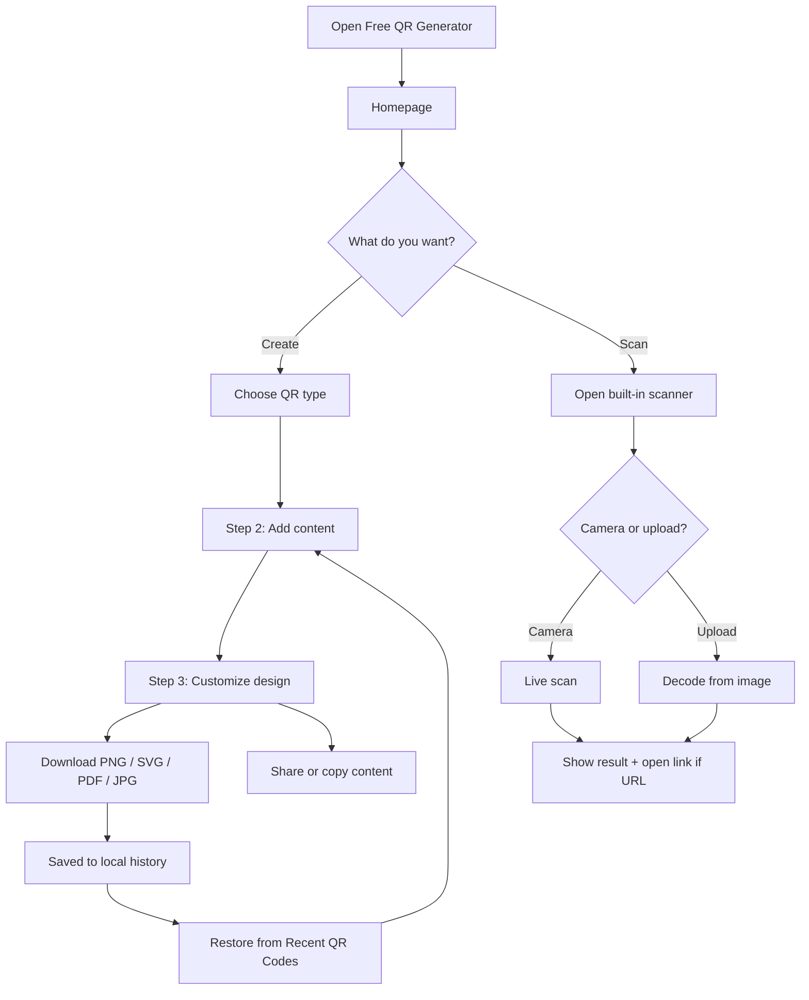
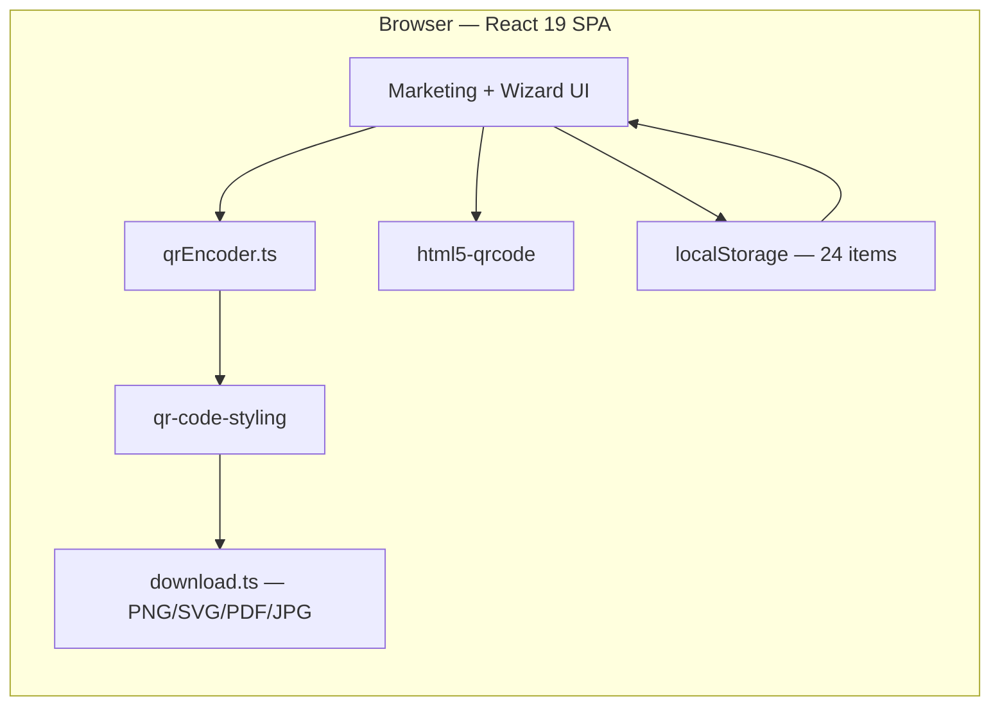

<div align="center">

# Free QR Code Generator

### Create Static QR Codes In Seconds.

**Generate, customize, download, and scan QR codes — entirely in your browser. No account. No expiry. No server.**

[](https://freeqrcodegen.vercel.app/)
[](https://react.dev/)
[](https://vite.dev/)
[](https://www.typescriptlang.org/)
[](https://tailwindcss.com/)

**[Try it live](https://freeqrcodegen.vercel.app/)**

</div>

---

## Table of Contents

- [Overview](#overview)
- [Key Features](#key-features)
- [User Flow](#user-flow)
- [Architecture](#architecture)
- [Tech Stack](#tech-stack)
- [Quick Start](#quick-start)
- [QR Content Types](#qr-content-types)
- [Project Structure](#project-structure)
- [Available Scripts](#available-scripts)
- [Deployment](#deployment)
- [How Static QR Codes Work](#how-static-qr-codes-work)
- [Privacy](#privacy)
- [License](#license)

---

## Overview

**Free QR Code Generator** is a production-ready, client-side web app for creating **static QR codes** — the kind that encode your data directly and never depend on a redirect service or subscription.

Pick from **12+ content types** (URL, vCard, Wi-Fi, phone, email, PDF, menu, app links, and more), walk through a simple **3-step wizard**, customize colors, frames, and logos, then download as **PNG, SVG, PDF, or JPG**. A built-in **camera scanner** reads any QR code in the browser, and your recent designs are saved locally so you can restore them anytime.

Everything runs in the browser. Nothing is uploaded to a backend.

---

## Key Features

- **100% static QR codes** — content is encoded directly; codes never expire and work offline after download
- **12+ content types** — URL, vCard, PDF, images, social, video, text, Wi-Fi, app, menu, phone, email
- **3-step creation wizard** — choose type → add content → customize design
- **Live preview** — instant updates as you edit content or styling
- **Rich customization** — foreground/background colors, size, error correction (L/M/Q/H), center logo, 6 frame styles
- **Multi-format export** — PNG, SVG, PDF, JPG with custom filenames
- **Built-in QR scanner** — camera scan or image upload via `html5-qrcode`; nothing leaves your device
- **Local history** — last 24 QR codes stored in `localStorage` with one-click restore
- **Social sharing** — WhatsApp, Facebook, X, LinkedIn, Telegram, email
- **Mobile-first UI** — responsive layout, safe-area support, touch-friendly controls
- **Accessible** — semantic HTML, ARIA labels, keyboard-friendly forms
- **Zero signup** — no accounts, no API keys required for end users

---

## User Flow



---

## Architecture

The app is a **single-page React application** with no backend. QR generation, encoding, rendering, export, scanning, and history all happen in the browser.



| Concern | Approach |
|---------|----------|
| Routing | React Router — `/` homepage, `/create/:slug` wizard |
| State | React hooks + `QrHistoryContext` |
| QR rendering | `qr-code-styling` canvas/SVG output |
| PDF export | jsPDF + canvas rasterization |
| Persistence | `localStorage` only — no database |
| Hosting | Static files on Vercel or Netlify (SPA rewrites) |

---

## Tech Stack

| Layer | Technology |
|-------|------------|
| Framework | React 19 + TypeScript 5.8 |
| Build | Vite 6 |
| Routing | React Router 7 |
| Styling | Tailwind CSS 3 + Inter font |
| QR engine | [qr-code-styling](https://www.npmjs.com/package/qr-code-styling) |
| Scanner | [html5-qrcode](https://www.npmjs.com/package/html5-qrcode) |
| PDF export | [jsPDF](https://github.com/parallax/jsPDF) |
| Icons | [Lucide React](https://lucide.dev) |
| Deployment | [Vercel](https://vercel.com/) (primary) · Netlify supported |

---

## Quick Start

### Prerequisites

- [Node.js](https://nodejs.org/) 18+ (20+ recommended)
- npm 9+

### Setup

```bash
git clone https://github.com/LakiyaDev/FreeQrCodeGenerator.git
cd FreeQrCodeGenerator

npm install
npm run dev
```

Open **http://localhost:5173**

### Production build

```bash
npm run build
npm run preview   # serve dist/ locally
```

Output is written to `dist/`.

---

## QR Content Types

| Type | Route slug | Encoded as |
|------|------------|------------|
| Website URL | `website-url` | `https://…` |
| vCard | `vcard` | vCard contact string |
| PDF | `pdf` | URL to hosted PDF |
| Images | `images` | URL to gallery |
| Social Media | `social-media` | Profile / link URL |
| Video | `video` | YouTube, Vimeo, etc. |
| Simple Text | `text` | Plain text |
| Wi-Fi | `wifi` | `WIFI:T:…;S:…;P:…;;` |
| App | `app` | App Store / Play Store URLs |
| Menu | `menu` | Digital menu URL |
| Phone | `phone` | `tel:+…` |
| Email | `email` | `mailto:…?subject=…&body=…` |

Unlike dynamic QR services that use short redirect URLs, every code above embeds the payload **directly** — so it keeps working even if this website goes offline.

---

## Project Structure

```
.
├── public/
│   ├── favicon.svg
│   └── hero-scan-me-qr.png
├── src/
│   ├── components/
│   │   ├── actions/          # Download, share, copy buttons
│   │   ├── generator/        # Wizard, forms, preview, customization
│   │   ├── history/          # Recent QR codes grid
│   │   ├── layout/           # Header, footer
│   │   ├── marketing/        # Hero, features, FAQ, how-it-works
│   │   ├── scanner/          # Camera + upload scanner
│   │   └── ui/               # Button, Input, Accordion
│   ├── config/
│   │   └── contentTypes.ts   # 12 QR type definitions + slugs
│   ├── context/
│   │   └── QrHistoryContext.tsx
│   ├── hooks/
│   │   ├── useDarkMode.ts
│   │   └── useQrHistory.ts
│   ├── lib/
│   │   ├── qrEncoder.ts      # Validation + payload encoding
│   │   ├── download.ts       # PNG, SVG, PDF, JPG export
│   │   └── share.ts          # Social share URLs + history helpers
│   ├── pages/
│   │   ├── HomePage.tsx
│   │   └── CreateQrPage.tsx  # 3-step wizard
│   ├── types/
│   ├── App.tsx
│   └── main.tsx
├── index.html
├── netlify.toml              # Netlify SPA config
├── vercel.json               # Vercel SPA rewrites
└── package.json
```

---

## Available Scripts

| Command | Description |
|---------|-------------|
| `npm run dev` | Start Vite dev server (port 5173) |
| `npm run build` | Type-check + production build → `dist/` |
| `npm run preview` | Preview production build locally |
| `npm run lint` | Run ESLint |

---

## Deployment

### Vercel (recommended)

The live site is deployed at **[freeqrcodegen.vercel.app](https://freeqrcodegen.vercel.app/)**.

1. Push the repo to GitHub
2. Import at [vercel.com/new](https://vercel.com/new)
3. Vite is auto-detected — build: `npm run build`, output: `dist`
4. `vercel.json` handles SPA routing

```bash
npx vercel
```

### Netlify

1. Connect the repo at [app.netlify.com](https://app.netlify.com)
2. Build command: `npm run build`
3. Publish directory: `dist`

`netlify.toml` is included with SPA redirect rules.

---

## How Static QR Codes Work

Dynamic QR services route scans through their servers with expiring short links. This app does the opposite:

1. You enter content (URL, phone number, Wi-Fi credentials, etc.)
2. The payload is encoded into the QR matrix **on your device**
3. The downloaded image is self-contained — scanners read the data directly

Once generated, your QR code works forever without depending on Free QR Generator.

---

## Privacy

- **No accounts** — nothing to sign up for
- **No server uploads** — generation and scanning happen client-side
- **No analytics required** — the core app has no mandatory tracking
- **Local history only** — stored in your browser's `localStorage`, clearable anytime

Camera access is requested only when you open the scanner and can be revoked in browser settings.

---


## License

© LakiyaDeV. All rights reserved.

For licensing questions, open an issue on the [repository](https://github.com/LakiyaDev/FreeQrCodeGenerator).

<div align="center">

---

Built for everyone who needs QR codes without subscriptions, redirects, or expiry dates.

**[freeqrcodegen.vercel.app](https://freeqrcodegen.vercel.app/)**

</div>
